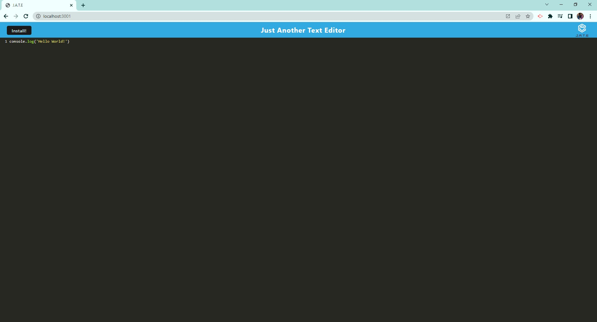
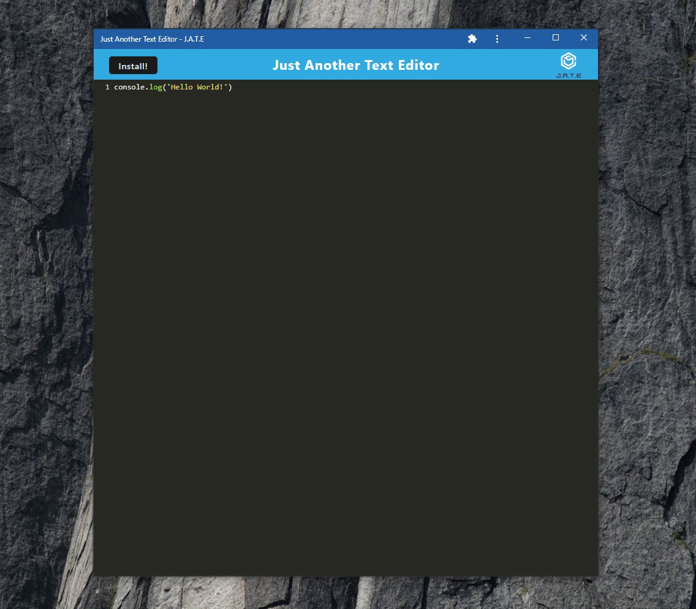

# Text Editor: Progressive Web Application

## Objectives
Build a text editor that will run in the browser. To build this text editor, you will start with an existing application and implement methods for getting and storing data to an IndexedDB database.

## Table of Contents
1. [Usage](#usage)
2. [Deployed Link](#deployed-link)
3. [Walkthrough Video](#walkthrough-video)
4. [Screenshots](#screenshots)
5. [Technologies Used](#technologies-used)
6. [License](#license)

## Usage
If you wish to run it locally, you can follow these instructions:

#### Step 1

Download or Clone this repo:
You can either download the repo as a zip file and unzip it to your computer, or you can clone it down to your computer directly.

#### Step 2

Navigate to App Directory:
Make sure you are in the directory of the application. It should be in a folder named text-editor-pwa. 

#### Step 3

Installation: 
In the terminal, type `'npm install'`. This script will install the necessary dependencies.

#### Step 4

Start the application:
In the command line, enter `'npm run start'`. As long as there are no errors, this should start the server and run it at http://localhost:3001

## Deployed Link
[J.A.T.E Heroku App](https://text-editor-inna.herokuapp.com/)

## Walkthrough Video
[Text Editor Video](https://youtu.be/u4g-uo0rn8o)

## Screenshots

## Technologies Used
Express, IndexedDb API, PWA

## License
This project is covered under MIT.